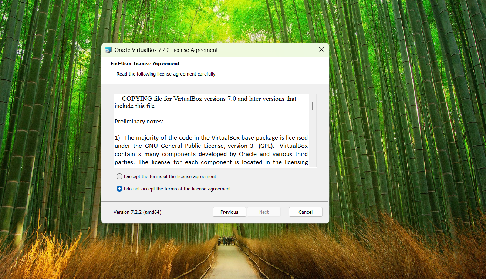

 ## How do We Get the VM?

1.Open your browser and search for **VirtualBox Download**

2. Click the offical Oracle VirtualBox line 

3. On the VirtualBox website click **Download**
-The page list the latest packages for each device

4. Under VirtualBox Platform Packages, select the **installer** for your OS:

-Windows hosts
-macOS (Intel/Apple Silicon)
-Linux distributions
-Solaris hosts
-For Windows users: click Windows hosts.

5. Start the Installation
Double-click the downloaded .exe file.
-Accept the **License Agreement** to continue.

6. Check the Disk Space
The installer will confirm available disk space.
If there’s enough space, click **OK**.

7. Install VirtualBox
Click Install to begin the installation process.
Wait for the progress bar to finish.

